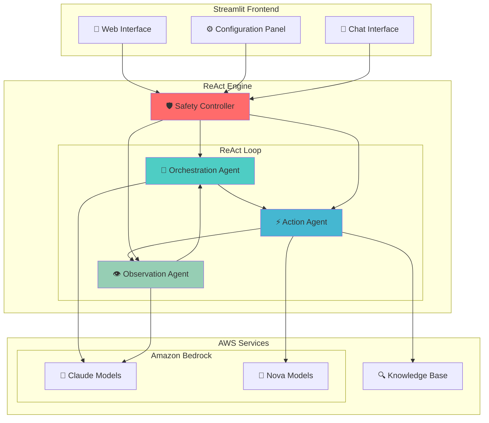
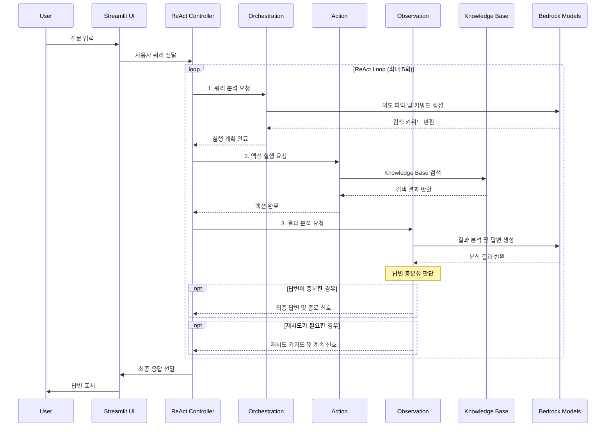

# 🤖 AWS Strands Agents ReAct Chatbot

**ReAct (Reasoning and Acting) 패턴**을 사용한 정교한 챗봇 구현으로, Amazon Bedrock과 Knowledge Base 통합을 제공합니다. 이 프로젝트는 Citation 지원과 다중 모델 유연성을 갖춘 고급 AI 에이전트 오케스트레이션을 보여줍니다.

> 🌍 **English Documentation**: [README.md](./README.md)

## 🚀 주요 특징


*▲ Streamlit 웹 인터페이스*

### 🧠 ReAct 패턴 구현
- **Orchestration → Action → Observation** 반복 루프
- 사용자 쿼리 분석 → 실행 계획 수립 → 액션 수행 → 결과 분석
- 최대 5회 반복으로 복잡한 문제 해결 (무한 루프 방지)

### 🤖 다중 모델 지원 및 최적화
- **Claude 모델**: Claude 4, Claude 3.7 Sonnet, Claude 3.5 Sonnet v2, Claude 3.5 Haiku
- **Nova 모델**: Nova Lite, Nova Micro
- **스마트 모델 배치**: 
  - **Orchestration & Observation**: Claude 모델 전용 (복잡한 추론 필요)
  - **Action**: 모든 모델 사용 가능 (단순 검색 실행)
- **권장 조합 제공**: 성능/비용 균형에 따른 3가지 프리셋

### 🔍 Knowledge Base 통합
- **Amazon Bedrock Knowledge Base** 연동
- **Hybrid 검색** (의미적 + 키워드 검색)
- **자동 재검색**: 결과 부족 시 대체 키워드로 재시도
- **5개 청크** 제한으로 최적화된 검색
- **Citation 지원**: 답변에 [1], [2] 형태의 인용 표시 및 참조 목록 제공

### 🛡️ 강력한 안전장치
- **무한루프 방지**: 최대 5회 반복 제한
- **중복 액션 감지**: 동일한 검색 키워드 반복 방지
- **연속 에러 제한**: 최대 3회 연속 에러 시 중단
- **자연스러운 종료**: 목표 달성 시 조기 종료

### 🎨 직관적인 UI
- **Streamlit 기반** 웹 인터페이스
- **실시간 진행 상황** 표시 (위 스크린샷 참조)
- **단계별 상세 정보** 확인 가능
- **대화 히스토리** 관리
- **색상 코딩**: ReAct 단계별 시각적 구분

## 🏗️ 시스템 아키텍처



## 🔄 ReAct 플로우



## 📋 요구사항

### 시스템 요구사항
- **Python**: 3.9 이상
- **운영체제**: Linux/macOS (Ubuntu 20.04+ 권장)
- **메모리**: 최소 4GB RAM
- **네트워크**: 인터넷 연결 (AWS API 호출용)

### AWS 요구사항
- **AWS 계정** 및 자격 증명 설정
- **Amazon Bedrock** 모델 액세스 권한
  - Claude 3.5 Haiku (필수)
  - Claude 3.5 Sonnet, Nova Lite/Micro (권장)
- **Amazon Bedrock Knowledge Base** (선택사항)
  - KB를 생성했다면 챗봇에 KB_ID를 입력

## 🛠️ 설치 및 실행

### 1. 저장소 클론
```bash
git clone https://github.com/jesamkim/aws-strands-agents-chatbot.git
cd aws-strands-agents-chatbot
```

### 2. Python 가상환경 생성 및 활성화
```bash
# Python 가상환경 생성
python3 -m venv venv

# 가상환경 활성화
# Linux/macOS:
source venv/bin/activate

# 가상환경 활성화 확인
which python
# 출력: /path/to/your/project/venv/bin/python
```

### 3. 의존성 설치
```bash
# 필요한 패키지 설치
pip install -r requirements.txt

# 설치 확인
pip list | grep streamlit
pip list | grep boto3
```

### 4. AWS 자격 증명 설정
```bash
# AWS CLI 설정 (권장)
aws configure
# AWS Access Key ID: [your-access-key]
# AWS Secret Access Key: [your-secret-key]
# Default region name: us-west-2
# Default output format: json

# 또는 환경 변수로 설정
export AWS_ACCESS_KEY_ID=your_access_key
export AWS_SECRET_ACCESS_KEY=your_secret_key
export AWS_DEFAULT_REGION=us-west-2
```

### 5. 애플리케이션 실행
```bash
# Streamlit 애플리케이션 시작
streamlit run main.py

# 또는 특정 포트로 실행
streamlit run main.py --server.port 8501
```

### 6. 브라우저에서 접속
```
http://localhost:8501
```

접속하면 위 스크린샷과 같은 직관적인 웹 인터페이스를 확인할 수 있습니다:

## 🚀 AWS 클라우드 배포 (CDK)

프로덕션 환경을 위한 AWS 클라우드 배포는 CDK(Cloud Development Kit) 배포 옵션을 사용하세요:

### 빠른 배포
```bash
cd CDK
./deploy.sh  # Linux/macOS
# 또는
deploy.bat   # Windows
```

### 수동 배포 단계
```bash
cd CDK

# 의존성 설치
pip install -r requirements.txt

# CDK 부트스트랩 (최초 1회만)
cdk bootstrap

# 배포 미리보기
cdk diff

# AWS에 배포
cdk deploy
```

### 배포 아키텍처
- **ECS Fargate**: 컨테이너화된 Streamlit 애플리케이션
- **Application Load Balancer**: 트래픽 분산 및 헬스체크
- **CloudFront**: 보안 헤더가 적용된 글로벌 CDN
- **VPC**: 퍼블릭/프라이빗 서브넷이 있는 격리된 네트워크 환경

### 배포 후 설정
배포가 성공적으로 완료되면 CloudFront URL을 받게 됩니다:
```
https://d1234567890abc.cloudfront.net
```

자세한 배포 지침, 문제 해결 및 구성 옵션은 [CDK/README.md](./CDK/README.md)를 참조하세요.

### 로컬 Docker 테스트
배포 전에 컨테이너화된 버전을 로컬에서 테스트:
```bash
cd CDK
./test-local.sh
```

### 리소스 정리
배포된 모든 AWS 리소스를 제거하려면:
```bash
cd CDK
./cleanup.sh
```
- 좌측 사이드바: 모델 설정 및 권장 조합 선택
- 메인 영역: 채팅 인터페이스 및 실시간 ReAct 단계 표시
- Citation 기능: 답변에 자동으로 포함되는 인용 및 참조 목록

## 🎛️ 사용법

### 1. 모델 설정
좌측 사이드바에서 각 ReAct 단계별 모델을 선택합니다:

- **🎯 Orchestration Model**: 쿼리 분석 및 계획 수립 (Claude 모델만)
- **⚡ Action Model**: 실제 액션 수행 (KB 검색 등, 모든 모델 사용 가능)
- **👁️ Observation Model**: 결과 분석 및 답변 생성 (Claude 모델만)

**권장 조합:**
- **🚀 고성능**: Claude Sonnet 4 (Orchestration) + Claude 3.7 Sonnet (Action) + Claude 3.5 Sonnet v2 (Observation)
- **⚖️ 균형**: Claude 3.5 Haiku (Orchestration) + Nova Lite (Action) + Claude 3.5 Haiku (Observation)
- **💰 경제적**: Claude 3.5 Haiku (Orchestration) + Nova Micro (Action) + Claude 3.5 Haiku (Observation) ⭐ 기본값

> 💡 **모델 제한 이유**: 테스트 결과 Nova 모델은 복잡한 추론(Orchestration, Observation)에서 성능이 제한적이므로, Action 단계에서만 사용하도록 제한했습니다.

### 2. 시스템 프롬프트 설정
Agent의 역할과 행동 방식을 정의하는 프롬프트를 입력합니다:

```
예시: "You are a helpful assistant for Anycompany information. 
Provide accurate and detailed information about Anycompany's business, 
procedures, and policies. Speak in Korean"
```

### 3. Knowledge Base 설정 (선택사항)
Amazon Bedrock Knowledge Base ID를 입력하면 RAG 기능이 활성화됩니다:

- **검색 타입**: Hybrid (의미적 + 키워드)
- **최대 결과**: 5개 청크
- **자동 재검색**: 결과 부족 시 대체 키워드 시도

### 4. 파라미터 조정
- **Temperature**: 0.0 (일관성) ~ 1.0 (창의성)
- **Max Tokens**: 
  - Claude 모델: 최대 8,000 토큰
  - Nova 모델: 최대 5,000 토큰

### 5. 연결 테스트
- **Bedrock 테스트**: Amazon Bedrock API 연결 확인
- **KB 테스트**: Knowledge Base 연결 및 검색 테스트


## 💬 사용 예시

> 💡 **실제 실행 화면**: 위의 스크린샷에서 Citation 기능이 포함된 실제 답변을 확인할 수 있습니다.

### 예시 1: Anycompany 투자 절차 문의
```
사용자: "Anycompany의 투자 승인 절차는 어떻게 되나요?"

🎯 Orchestration: 투자 절차 관련 키워드 5개 생성
⚡ Action: Knowledge Base에서 5개 관련 문서 검색
👁️ Observation: 검색 결과 분석 후 구조화된 답변 생성

결과: 단계별 투자 승인 절차 상세 설명 (1회 반복으로 완료)
      Citation [1], [2] 포함 및 참조 목록 제공
```

### 예시 2: Citation이 포함된 답변 (실제 화면)
```
실제 답변에는 다음과 같은 Citation 기능이 포함됩니다:

답변: "T.xxx 법인의 실태조사 결과 보고는 일반적으로 사장님에게 최종 보고되는 것이 맞습니다.
검색 결과에 따르면 대부분의 중요한 사업 및 경영 관련 보고는 '대표이사 사장'에게 
최종적으로 보고됩니다 [1][2]. 예를 들어, 경영방침 설정, 사업계획 수립 등 주요 사안은 
반드시 대표이사/사장의 승인을 받도록 되어 있습니다 [2].

**참조:**
[1] S3: s3://250703-xxxx-kb/data/xxxx_inter_final.csv: 연결 경영자확인서 제출...
[2] S3: s3://250703-xxxx-kb/data/xxxx_inter_final.csv: 체육관 관리, 품의서..."
```

### 예시 3: 모호한 질문 처리
```
사용자: "Anycompany의 출장 규정에 대해 알려주세요"

🔄 1회차: 일반적 키워드로 검색 → 결과 부족
🔄 2회차: 구체적 키워드로 재검색 → 부분적 결과
🛡️ 안전장치: 중복 액션 감지로 적절한 시점에 종료

결과: 검색된 정보 기반 부분 답변 + 더 구체적 질문 요청
```

## 🛡️ 안전장치 상세

### 무한루프 방지 메커니즘
1. **최대 반복 횟수**: 5회 하드 리미트
2. **중복 액션 감지**: 동일한 검색 키워드 반복 시 중단
3. **연속 에러 제한**: 3회 연속 에러 발생 시 중단
4. **실행 시간 추적**: 비정상적 장시간 실행 모니터링

### 에러 처리
- **JSON 파싱 실패**: 폴백 로직으로 직접 답변 추출
- **API 호출 실패**: 재시도 로직 및 사용자 친화적 에러 메시지
- **Knowledge Base 오류**: 검색 실패 시 대체 키워드 시도

## 📁 프로젝트 구조

```
aws-strands-agents-chatbot/
├── main.py                 # Streamlit 메인 애플리케이션
├── requirements.txt        # Python 의존성 패키지
├── README.md              # 프로젝트 문서
│
├── agents/                # ReAct Agent 구현
│   ├── __init__.py
│   ├── react_agent.py     # 메인 ReAct 엔진 + 안전장치
│   ├── orchestration.py   # 쿼리 분석 및 계획 수립
│   ├── action.py          # KB 검색 및 도구 실행
│   └── observation.py     # 결과 분석 및 답변 생성
│
├── utils/                 # 유틸리티 클래스
│   ├── __init__.py
│   ├── bedrock_client.py  # Amazon Bedrock API 클라이언트
│   ├── kb_search.py       # Knowledge Base 검색 엔진
│   └── config.py          # 설정 관리 및 모델 정의
│
└── ui/                    # Streamlit UI 컴포넌트
    ├── __init__.py
    ├── sidebar.py         # 설정 패널 (모델 선택, 파라미터)
    └── chat.py           # 채팅 인터페이스 (메시지, 진행 상황)
```

## 🔧 고급 설정

### 환경 변수 설정
```bash
# .env 파일 생성 (선택사항)
cat > .env << EOF
AWS_ACCESS_KEY_ID=your_access_key
AWS_SECRET_ACCESS_KEY=your_secret_key
AWS_DEFAULT_REGION=us-west-2
STREAMLIT_SERVER_PORT=8501
EOF
```

### 커스텀 모델 추가
`utils/config.py`에서 새로운 모델을 추가할 수 있습니다:

```python
AVAILABLE_MODELS = {
    "Your Custom Model": "your.custom.model.id",
    # ... 기존 모델들
}
```

### Knowledge Base 최적화
- **청크 크기**: 300-500 토큰 권장
- **오버랩**: 50-100 토큰 권장
- **메타데이터**: 소스, 날짜, 카테고리 포함

## 🚨 문제 해결

### 일반적인 문제

#### 1. AWS 자격 증명 오류
```bash
# 자격 증명 확인
aws sts get-caller-identity

# 리전 확인
aws configure get region
```

#### 2. 모델 접근 권한 오류
- AWS 콘솔 → Bedrock → Model access에서 모델 활성화


#### 3. Knowledge Base 연결 실패
```bash
# KB ID 확인
aws bedrock-agent list-knowledge-bases --region us-west-2

# KB 상태 확인
aws bedrock-agent get-knowledge-base --knowledge-base-id YOUR_KB_ID
```

#### 4. Streamlit 실행 오류
```bash
# 포트 충돌 확인
lsof -i :8501

# 다른 포트로 실행
streamlit run main.py --server.port 8502
```

### 성능 최적화

#### 메모리 사용량 최적화
```python
# config.py에서 토큰 수 조정
max_tokens = 2000  # 기본값 4000에서 감소
```

#### 응답 속도 개선
- **Orchestration**: Claude 3.5 Haiku (빠름)
- **Action**: Nova Lite (빠름)
- **Observation**: Claude 3.5 Haiku (빠름)

#### 모델별 특성
| 모델 | 성능 | 비용 | 권장 용도 | 최대 토큰 |
|------|------|------|-----------|-----------|
| Claude Sonnet 4 | 최고 | 최고 | Orchestration, Observation | 8,000 |
| Claude 3.7 Sonnet | 매우 높음 | 높음 | Orchestration, Observation | 8,000 |
| Claude 3.5 Sonnet v2 | 높음 | 중간 | Orchestration, Observation | 8,000 |
| Claude 3.5 Haiku | 좋음 | 낮음 | 모든 단계 | 8,000 |
| Nova Lite | 중간 | 매우 낮음 | Action 전용 | 5,000 |
| Nova Micro | 기본 | 최저 | Action 전용 | 5,000 |

## 📊 모니터링 및 로깅

### 실행 메트릭
애플리케이션은 다음 정보를 추적합니다:
- **반복 횟수**: 각 쿼리당 ReAct 루프 실행 횟수
- **실행 시간**: 전체 응답 생성 시간
- **안전장치 작동**: 무한루프 방지 작동 여부
- **모델 사용량**: 각 단계별 사용된 모델

### 로그 확인
```bash
# Streamlit 로그 확인
tail -f streamlit.log

# 실시간 로그 모니터링
streamlit run main.py --logger.level debug
```


### 새로운 Agent 추가
1. `agents/` 디렉토리에 새 Agent 클래스 생성
2. `agents/__init__.py`에 import 추가
3. `react_agent.py`에 통합

### 새로운 도구 추가
1. `agents/action.py`에 새 도구 메서드 추가
2. 도구 선택 로직 업데이트
3. 테스트 케이스 작성

## 📄 라이선스

이 프로젝트는 MIT 라이선스 하에 배포됩니다.

## 🔗 참고 자료

- [AWS Strands Agents Workshop](https://catalog.us-east-1.prod.workshops.aws/workshops/33f099a6-45a2-47d7-9e3c-a23a6568821e/en-US)
- [Amazon Bedrock Documentation](https://docs.aws.amazon.com/bedrock/)
- [Amazon Bedrock Knowledge Base](https://docs.aws.amazon.com/bedrock/latest/userguide/knowledge-base.html)
- [ReAct: Synergizing Reasoning and Acting in Language Models](https://arxiv.org/abs/2210.03629)
- [Streamlit Documentation](https://docs.streamlit.io/)


---

