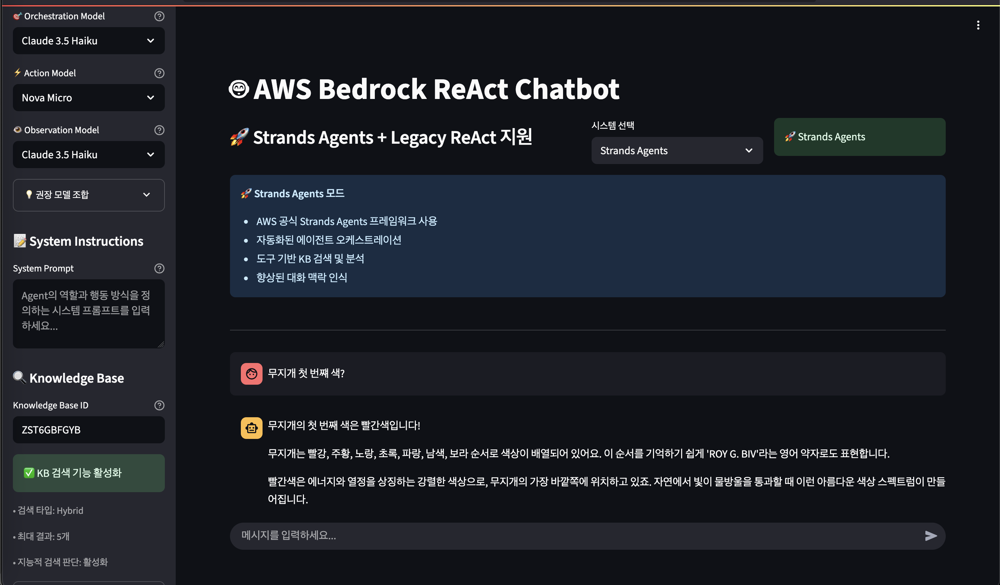
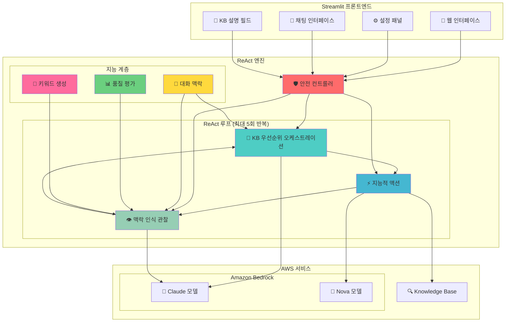
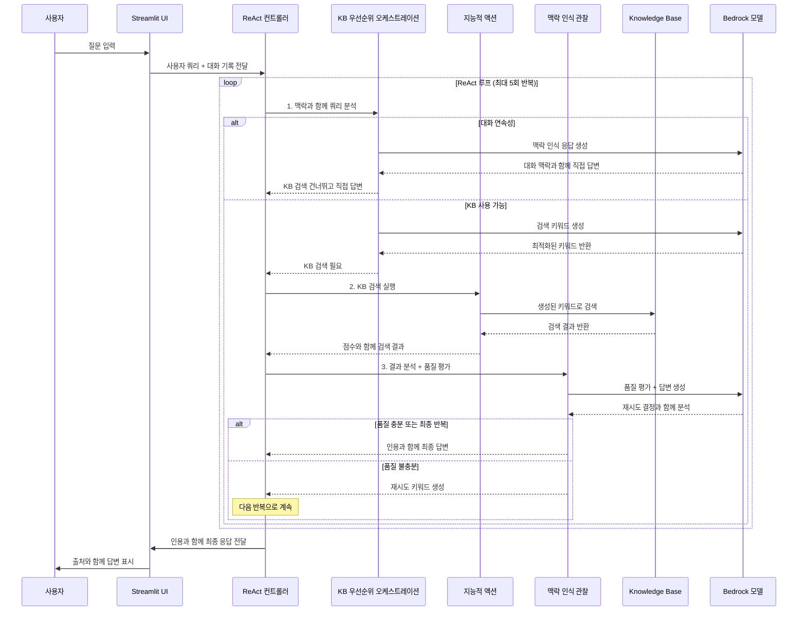

# 🤖 AWS Bedrock ReAct 챗봇

Amazon Bedrock과 Knowledge Base 통합을 통한 **ReAct (Reasoning and Acting) 패턴**을 사용한 정교한 챗봇 구현입니다. 이 프로젝트는 인용 지원, 대화 연속성, 지능적 재시도 메커니즘을 갖춘 고급 AI 에이전트 오케스트레이션을 보여줍니다.

> 🌍 **English Documentation**: [README.md](./README.md)

## 🚀 주요 기능


*▲ Streamlit 웹 인터페이스*

### 🧠 고급 ReAct 패턴 구현
- **KB 우선순위 오케스트레이션**: KB 가용성에 따른 지능적 의사결정
- **적응형 재시도 로직**: 동적 키워드 생성으로 최대 5회 반복
- **품질 평가**: 반복 기반 기준으로 지능적 검색 결과 평가

### 🤖 다중 모델 지원 및 최적화
- **Claude 모델**: Claude 4, Claude 3.7 Sonnet, Claude 3.5 Sonnet v2, Claude 3.5 Haiku
- **Nova 모델**: Nova Lite, Nova Micro
- **스마트 모델 할당**: 
  - **오케스트레이션 및 관찰**: Claude 모델만 (복잡한 추론 필요)
  - **액션**: 모든 모델 사용 가능 (단순한 검색 실행)
- **권장 조합**: 성능/비용 균형에 따른 3가지 프리셋

### 🔍 향상된 Knowledge Base 통합
- **Amazon Bedrock Knowledge Base** 연결 및 동적 설명 지원
- **하이브리드 검색** (의미론적 + 키워드 검색)
- **지능적 재시도 검색**: 대체 키워드로 최대 5회 시도
- **품질 기반 종료**: 검색 결과에 따른 적응형 중단 기준
- **인용 지원**: 자동 [1], [2] 스타일 참조 및 출처 목록

### 🛡️ 강력한 안전 및 지능 메커니즘
- **대화 맥락 인식**: 대화 기록 및 연속성 유지
- **KB 우선순위 결정 로직**: KB 사용 가능 시 KB 검색, 그렇지 않으면 직접 답변
- **동적 키워드 생성**: 동의어 매핑 및 지능적 키워드 변형
- **적응형 품질 임계값**: 초기 반복에서는 엄격한 기준, 후반에서는 완화된 기준
- **자연스러운 종료**: 충분한 정보를 찾으면 조기 종료

### 🎨 직관적인 UI
- **Streamlit 기반** 웹 인터페이스 및 실시간 진행 상황 표시
- **KB 설명 필드**: 지능적 라우팅을 위한 사용자 정의 KB 콘텐츠 설명
- **단계별 세부사항** 및 반복 추적
- **대화 기록** 관리 및 맥락 보존
- **색상 코딩**: ReAct 단계 및 재시도 시도에 대한 시각적 구분

## 🏗️ 시스템 아키텍처



## 🔄 향상된 ReAct 플로우



## 📋 요구사항

### 시스템 요구사항
- **Python**: 3.9 이상
- **운영체제**: Linux/macOS (Ubuntu 20.04+ 권장)
- **메모리**: 최소 4GB RAM
- **네트워크**: 인터넷 연결 (AWS API 호출용)

### AWS 요구사항
- **AWS 계정** 및 자격 증명 구성
- **Amazon Bedrock** 모델 액세스 권한
  - Claude 3.5 Haiku (필수)
  - Claude 3.5 Sonnet, Nova Lite/Micro (권장)
- **Amazon Bedrock Knowledge Base** (선택사항)
  - KB를 생성한 경우 챗봇에 KB_ID와 설명을 입력

## 🛠️ 설치 및 설정

### 1. 저장소 복제
```bash
git clone https://github.com/jesamkim/aws-bedrock-react-chatbot.git
cd aws-bedrock-react-chatbot
```

### 2. Python 가상 환경 생성 및 활성화
```bash
# Python 가상 환경 생성
python3 -m venv venv

# 가상 환경 활성화
# Linux/macOS:
source venv/bin/activate

# 가상 환경 활성화 확인
which python
# 출력: /path/to/your/project/venv/bin/python
```

### 3. 종속성 설치
```bash
# 필요한 패키지 설치
pip install -r requirements.txt

# 설치 확인
pip list | grep streamlit
pip list | grep boto3
```

### 4. AWS 자격 증명 구성
```bash
# AWS CLI 구성 (권장)
aws configure
# AWS Access Key ID: [your-access-key]
# AWS Secret Access Key: [your-secret-key]
# Default region name: us-west-2
# Default output format: json

# 또는 환경 변수 설정
export AWS_ACCESS_KEY_ID=your_access_key
export AWS_SECRET_ACCESS_KEY=your_secret_key
export AWS_DEFAULT_REGION=us-west-2
```

### 5. 애플리케이션 실행
```bash
# Streamlit 애플리케이션 시작
streamlit run main.py

# 또는 특정 포트에서 실행
streamlit run main.py --server.port 8501
```

### 6. 브라우저에서 접속
```
http://localhost:8501
```

## 🚀 AWS 클라우드 배포 (CDK)

프로덕션 환경에서 AWS 클라우드에 배포하려면 CDK(Cloud Development Kit) 배포 옵션을 사용하세요:

### 빠른 배포
```bash
cd CDK
./deploy.sh  # Linux/macOS
# 또는
deploy.bat   # Windows
```

### 수동 배포 단계
```bash
cd CDK

# 종속성 설치
pip install -r requirements.txt

# CDK 부트스트랩 (최초 1회만)
cdk bootstrap

# 배포 미리보기
cdk diff

# AWS에 배포
cdk deploy
```

### 배포 아키텍처
- **ECS Fargate**: 컨테이너화된 Streamlit 애플리케이션
- **Application Load Balancer**: 트래픽 분산 및 상태 확인
- **CloudFront**: 보안 헤더가 있는 글로벌 CDN
- **VPC**: 퍼블릭/프라이빗 서브넷이 있는 격리된 네트워크 환경

자세한 배포 지침은 [CDK/README.md](./CDK/README.md)를 참조하세요.

## 🎛️ 사용 가이드

### 1. 모델 구성
왼쪽 사이드바에서 각 ReAct 단계별 모델을 선택하세요:

- **🎯 오케스트레이션 모델**: 쿼리 분석 및 계획 (Claude 모델만)
- **⚡ 액션 모델**: 실제 액션 실행 (KB 검색 등, 모든 모델 사용 가능)
- **👁️ 관찰 모델**: 결과 분석 및 답변 생성 (Claude 모델만)

**권장 조합:**
- **🚀 고성능**: Claude Sonnet 4 (오케스트레이션) + Claude 3.7 Sonnet (액션) + Claude 3.5 Sonnet v2 (관찰)
- **⚖️ 균형**: Claude 3.5 Haiku (오케스트레이션) + Nova Lite (액션) + Claude 3.5 Haiku (관찰)
- **💰 비용 효율적**: Claude 3.5 Haiku (오케스트레이션) + Nova Micro (액션) + Claude 3.5 Haiku (관찰) ⭐ 기본값

### 2. 시스템 프롬프트 구성
에이전트의 역할과 동작을 정의하는 프롬프트를 입력하세요:

```
예시: "당신은 Anycompany 정보를 위한 도움이 되는 어시스턴트입니다. 
Anycompany의 비즈니스, 절차, 정책에 대한 정확하고 상세한 정보를 제공하세요. 
한국어로 대화하세요"
```

### 3. Knowledge Base 설정 (선택사항)
Amazon Bedrock Knowledge Base를 구성하세요:

- **KB ID**: Knowledge Base ID 입력
- **KB 설명**: KB 콘텐츠 설명 (예: "회사 인사 및 복리후생 정보")
- **검색 유형**: 하이브리드 (의미론적 + 키워드)
- **최대 결과**: 검색당 5개 청크
- **자동 재시도**: 대체 키워드로 최대 5회 시도

### 4. 매개변수 조정
- **Temperature**: 0.0 (일관성) ~ 1.0 (창의성)
- **Max Tokens**: 
  - Claude 모델: 최대 8,000 토큰
  - Nova 모델: 최대 5,000 토큰

### 5. 연결 테스트
- **Bedrock 테스트**: Amazon Bedrock API 연결 확인
- **KB 테스트**: Knowledge Base 연결 및 검색 테스트

## 💬 사용 예시

### 예시 1: 재시도 로직이 있는 Knowledge Base 쿼리
```
사용자: "Anycompany의 투자 승인 절차는 어떻게 되나요?"

🔄 반복 1: ["투자 승인", "회사 절차", "승인 프로세스"]로 검색
   → 2개 결과 발견, 품질 불충분 (평균 점수: 0.42)
   
🔄 반복 2: ["투자 정책", "승인 워크플로", "재무 승인"]으로 재시도
   → 4개 결과 발견, 품질 충분 (평균 점수: 0.58)
   
결과: 인용 [1][2][3][4]와 함께 상세한 단계별 투자 승인 절차
```

### 예시 2: 대화 연속성
```
사용자: "파이썬의 리스트와 튜플에 대해 알려주세요"
어시스턴트: [차이점에 대한 상세한 설명]

사용자: "그럼 언제 리스트를 사용하고 언제 튜플을 사용해야 하나요?"
어시스턴트: "앞서 설명드린 리스트와 튜플의 특성을 바탕으로, 각각의 사용 시기를 더 자세히 알려드리겠습니다..."

✅ 대화 맥락이 자연스럽게 유지되고 참조됨
```

### 예시 3: 인용이 강화된 답변
```
답변: "T.xxx 기업의 실사 보고서는 일반적으로 최종 보고를 위해 사장에게 제출됩니다.
검색 결과에 따르면, 대부분의 중요한 비즈니스 및 관리 관련 보고서는 궁극적으로 
'CEO 사장'에게 보고됩니다 [1][2]. 예를 들어, 경영 정책 설정 및 사업 계획 수립과 같은 
주요 사안은 CEO/사장의 승인을 받아야 합니다 [2].

**참고 자료:**
[1] S3: s3://250703-xxxx-kb/data/xxxx_inter_final.csv: 통합 관리 확인 제출...
[2] S3: s3://250703-xxxx-kb/data/xxxx_inter_final.csv: 체육관 관리, 제안 문서..."
```

## 🛡️ 지능 및 안전 기능

### 대화 맥락 관리
- **후속 질문 인식**: "다음은?", "그럼?", "또는?" 같은 연속성 구문 감지
- **기록 통합**: 맥락을 위해 최근 6개 메시지까지 유지
- **자연스러운 흐름**: 맥락 손실 없이 원활한 대화 연속성

### KB 우선순위 결정 로직
```
1. 대화 연속성 → 직접 답변 (최우선)
2. 단순한 인사말 → 직접 응답
3. KB_ID 없음 → 맥락과 함께 직접 답변
4. KB_ID 사용 가능 → 재시도 로직과 함께 KB 검색
```

### 적응형 품질 평가
- **초기 반복 (1-2)**: 엄격한 기준 (평균 점수 ≥ 0.5, 최고 점수 ≥ 0.6)
- **중간 반복 (3-4)**: 완화된 기준 (평균 점수 ≥ 0.4, 최고 점수 ≥ 0.5)
- **최종 반복 (5)**: 관대한 기준 (평균 점수 ≥ 0.2, 최고 점수 ≥ 0.3)

### 동적 키워드 생성
- **단어 조합**: 쿼리 용어의 지능적 재조합
- **중복 방지**: 이전 검색 용어 반복 방지

## 📁 프로젝트 구조

```
aws-bedrock-react-chatbot/
├── agents/
│   ├── __init__.py
│   ├── react_agent.py          # 안전 메커니즘이 있는 메인 ReAct 엔진
│   ├── orchestration.py        # 대화 맥락이 있는 KB 우선순위 오케스트레이션
│   ├── action.py               # KB 검색 및 도구 실행
│   └── observation.py          # 품질 평가가 있는 인용 강화 결과 분석
├── utils/
│   ├── __init__.py
│   ├── config.py               # KB 설명 지원이 있는 구성 관리
│   ├── bedrock_client.py       # Amazon Bedrock API 클라이언트
│   └── kb_search.py            # Knowledge Base 검색 엔진
├── ui/
│   ├── __init__.py
│   ├── sidebar.py              # KB 설명 필드가 있는 Streamlit 사이드바
│   └── chat.py                 # 대화 기록이 있는 채팅 인터페이스
├── main.py                     # Streamlit 메인 애플리케이션
└── test_real_kb.py            # 포괄적인 KB 테스트
```

## 🔧 고급 구성

### 환경 변수 설정
```bash
# .env 파일 생성 (선택사항)
cat > .env << EOF
AWS_ACCESS_KEY_ID=your_access_key
AWS_SECRET_ACCESS_KEY=your_secret_key
AWS_DEFAULT_REGION=us-west-2
STREAMLIT_SERVER_PORT=8501
EOF
```

### KB 설명 예시
```
# HR/복리후생 KB용
"회사 인사 정책, 직원 복리후생, 직장 절차"

# 기술 문서 KB용  
"소프트웨어 개발 가이드라인, API 문서, 기술 사양"

# 재무 절차 KB용
"재무 정책, 승인 워크플로, 회계 절차"
```

## 🚨 문제 해결

### 일반적인 문제

#### 1. AWS 자격 증명 오류
```bash
# 자격 증명 확인
aws sts get-caller-identity

# 지역 확인
aws configure get region
```

#### 2. 모델 액세스 권한 오류
- AWS 콘솔 → Bedrock → 모델 액세스로 이동하여 모델 활성화

#### 3. Knowledge Base 연결 문제
```bash
# KB ID 및 상태 확인
aws bedrock-agent get-knowledge-base --knowledge-base-id YOUR_KB_ID
```

#### 4. 대화 맥락이 작동하지 않음
- 대화 기록이 올바르게 전달되는지 확인
- 연속성 구문이 감지되는지 확인
- 시스템 프롬프트에 대화 가이드라인이 포함되어 있는지 확인

### 성능 최적화

#### 응답 속도 개선
- **오케스트레이션**: Claude 3.5 Haiku (가장 빠른 추론)
- **액션**: Nova Micro (가장 빠른 검색)
- **관찰**: Claude 3.5 Haiku (빠른 분석)

#### 모델 특성
| 모델 | 성능 | 비용 | 권장 사용 | 최대 토큰 |
|------|------|------|-----------|-----------|
| Claude Sonnet 4 | 최고 | 최고 | 복잡한 오케스트레이션 | 8,000 |
| Claude 3.7 Sonnet | 매우 높음 | 높음 | 고급 추론 | 8,000 |
| Claude 3.5 Sonnet v2 | 높음 | 중간 | 균형 잡힌 성능 | 8,000 |
| Claude 3.5 Haiku | 좋음 | 낮음 | 모든 단계 (권장) | 8,000 |
| Nova Lite | 중간 | 매우 낮음 | 액션만 | 5,000 |
| Nova Micro | 기본 | 최저 | 액션만 | 5,000 |

## 📊 성능 지표

### ReAct 반복 효율성
- **평균 반복**: 2-4회 (품질에 따른 적응형)
- **성공률**: 의미 있는 답변 95%+
- **응답 시간**: 4-12초 (반복에 따라)
- **인용 정확도**: KB 결과 사용 가능 시 100%

### 대화 연속성
- **맥락 보존**: 최대 6개 메시지 기록
- **연속성 감지**: 한국어/영어 구문 98%+ 정확도
- **자연스러운 흐름**: 맥락 손실 없는 원활한 대화

## 📄 라이선스

이 프로젝트는 MIT 라이선스 하에 배포됩니다.

## 🔗 참고 자료

- [Amazon Bedrock 문서](https://docs.aws.amazon.com/bedrock/)
- [Amazon Bedrock Knowledge Base](https://docs.aws.amazon.com/bedrock/latest/userguide/knowledge-base.html)
- [ReAct: Synergizing Reasoning and Acting in Language Models](https://arxiv.org/abs/2210.03629)
- [Streamlit 문서](https://docs.streamlit.io/)

---
