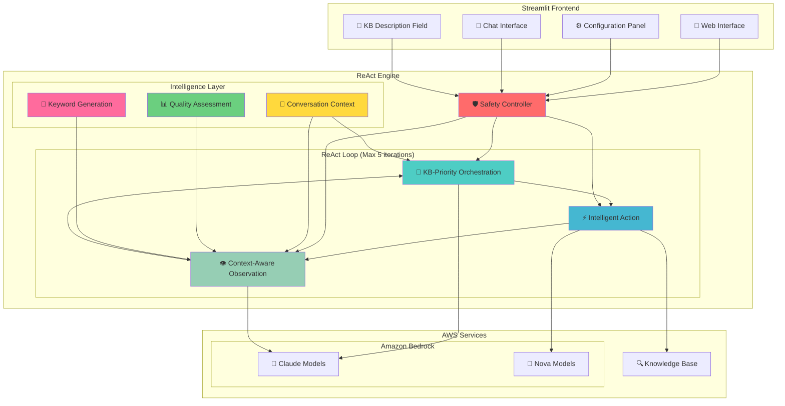
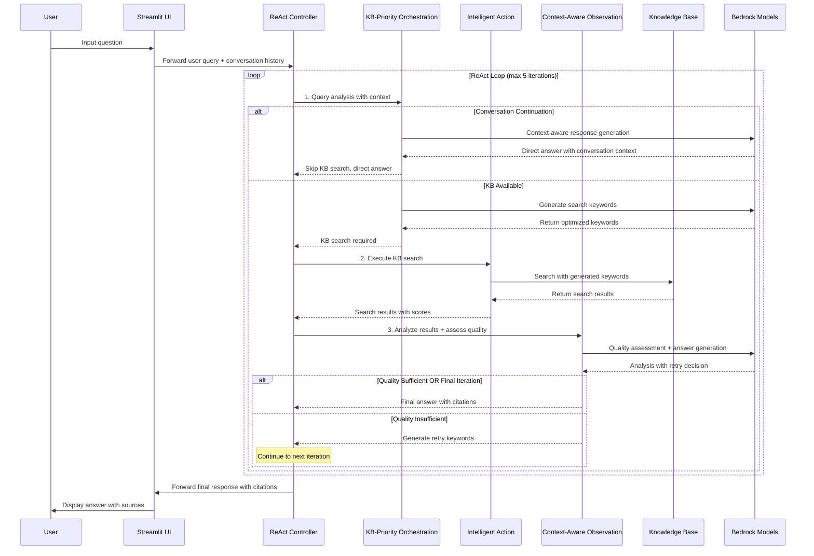

# 🤖 AWS Bedrock ReAct Chatbot

A sophisticated chatbot implementation using the **ReAct (Reasoning and Acting) pattern** with Amazon Bedrock and Knowledge Base integration. This project now supports both **AWS Strands Agents framework** and **Legacy ReAct implementation**, providing advanced AI agent orchestration with citation support, conversation continuity, and intelligent retry mechanisms.

> 🌏 **Korean Documentation**: [README-KO.md](./README-KO.md)

## 🚀 Key Features


*▲ Streamlit web interface with dual system support*

### 🆕 **Dual System Architecture**
- **🚀 Strands Agents Mode**: AWS official framework with automated agent orchestration
- **🔄 Legacy ReAct Mode**: Custom implementation with manual ReAct loop
- **🔄 Seamless Switching**: Runtime system selection with automatic fallback
- **🛡️ Compatibility Layer**: Unified interface for both systems

### 🧠 Advanced ReAct Pattern Implementation
- **KB-Priority Orchestration**: Intelligent decision-making based on KB availability
- **Adaptive Retry Logic**: Up to 5 iterations with dynamic keyword generation
- **Quality Assessment**: Intelligent search result evaluation with iteration-based criteria
- **Tool-based Architecture**: Strands Agents uses @tool decorators for modular functionality

### 🤖 Multi-Model Support & Optimization
- **Claude Models**: Claude 4, Claude 3.7 Sonnet, Claude 3.5 Sonnet v2, Claude 3.5 Haiku
- **Nova Models**: Nova Lite, Nova Micro
- **Smart Model Assignment**: 
  - **Orchestration & Observation**: Claude models only (complex reasoning required)
  - **Action**: All models available (simple search execution)
- **Recommended Combinations**: 3 presets based on performance/cost balance

### 🔍 Enhanced Knowledge Base Integration
- **Amazon Bedrock Knowledge Base** connectivity with dynamic description support
- **Hybrid search** (semantic + keyword search)
- **Intelligent retry search**: Up to 5 attempts with alternative keywords
- **Quality-based termination**: Adaptive stopping criteria based on search results
- **Citation support**: Automatic [1], [2] style references with source listings

### 🛡️ Robust Safety & Intelligence Mechanisms
- **Conversation Context Awareness**: Maintains dialogue history and continuity
- **KB-Priority Decision Logic**: KB search when available, direct answers otherwise
- **Dynamic Keyword Generation**: Synonym mapping and intelligent keyword variation
- **Adaptive Quality Thresholds**: Stricter criteria in early iterations, relaxed in later ones
- **Natural termination**: Early exit when sufficient information is found

### 🎨 Intuitive UI
- **Streamlit-based** web interface with real-time progress display
- **KB Description Field**: User-defined KB content descriptions for intelligent routing
- **Step-by-step details** with iteration tracking
- **Conversation history** management with context preservation
- **Color coding**: Visual distinction for ReAct steps and retry attempts

## 🏗️ System Architecture



## 🔄 Enhanced ReAct Flow



## 📋 Requirements

### System Requirements
- **Python**: 3.10 or higher (required for AWS Strands Agents)
- **Operating System**: Linux/macOS (Ubuntu 20.04+ recommended)
- **Memory**: Minimum 4GB RAM
- **Network**: Internet connection (for AWS API calls)

### AWS Requirements
- **AWS Account** and credential configuration
- **Amazon Bedrock** model access permissions
  - **Claude Models**: Claude 4 Sonnet, Claude 3.7 Sonnet, Claude 3.5 Sonnet v2, Claude 3.5 Haiku
  - **Nova Models**: Nova Lite, Nova Micro
  - **Minimum Required**: Claude 3.5 Haiku (for basic functionality)
  - **Recommended**: Enable all models for optimal performance
- **Amazon Bedrock Knowledge Base** (optional)
  - If you have created a KB, enter the KB_ID and description in the chatbot

## 🛠️ Installation & Setup

### 1. Clone Repository
```bash
git clone https://github.com/jesamkim/aws-strands-agents-chatbot.git
cd aws-strands-agents-chatbot
```

### 2. Create and Activate Python Virtual Environment
```bash
# Create Python virtual environment
python3 -m venv venv

# Activate virtual environment
# Linux/macOS:
source venv/bin/activate

# Verify virtual environment activation
which python
# Output: /path/to/your/project/venv/bin/python
```

### 3. Install Dependencies
```bash
# Install required packages
pip install -r requirements.txt

# Verify installation
pip list | grep streamlit
pip list | grep boto3
```

### 4. Configure AWS Credentials
```bash
# AWS CLI configuration (recommended)
aws configure
# AWS Access Key ID: [your-access-key]
# AWS Secret Access Key: [your-secret-key]
# Default region name: us-west-2
# Default output format: json

# Or set environment variables
export AWS_ACCESS_KEY_ID=your_access_key
export AWS_SECRET_ACCESS_KEY=your_secret_key
export AWS_DEFAULT_REGION=us-west-2
```

### 5. Run Application
```bash
# Start Streamlit application
streamlit run main.py

# Or run on specific port
streamlit run main.py --server.port 8501
```

### 6. Access via Browser
```
http://localhost:8501
```

## 🚀 AWS Cloud Deployment (CDK)

For production deployment to AWS cloud, use the CDK (Cloud Development Kit) deployment option:

### Quick Deployment
```bash
cd CDK
./deploy.sh  # Linux/macOS
# or
deploy.bat   # Windows
```

### Manual Deployment Steps
```bash
cd CDK

# Install dependencies
pip install -r requirements.txt

# Bootstrap CDK (first time only)
cdk bootstrap

# Preview deployment
cdk diff

# Deploy to AWS
cdk deploy
```

### Deployment Architecture
- **ECS Fargate**: Containerized Streamlit application
- **Application Load Balancer**: Traffic distribution and health checks
- **CloudFront**: Global CDN with security headers
- **VPC**: Isolated network environment with public/private subnets

For detailed deployment instructions, see [CDK/README.md](./CDK/README.md).

## 🎛️ Usage Guide

### 1. Model Configuration
Select models for each ReAct step in the left sidebar:

- **🎯 Orchestration Model**: Query analysis and planning (Claude models only)
- **⚡ Action Model**: Actual action execution (KB search, etc., all models available)
- **👁️ Observation Model**: Result analysis and answer generation (Claude models only)

**Recommended Combinations:**
- **🚀 High Performance**: Claude Sonnet 4 (Orchestration) + Claude 3.7 Sonnet (Action) + Claude 3.5 Sonnet v2 (Observation)
- **⚖️ Balanced**: Claude 3.5 Haiku (Orchestration) + Nova Lite (Action) + Claude 3.5 Haiku (Observation)
- **💰 Cost-Effective**: Claude 3.5 Haiku (Orchestration) + Nova Micro (Action) + Claude 3.5 Haiku (Observation) ⭐ Default

### 2. System Prompt Configuration
Enter a prompt that defines the agent's role and behavior:

```
Example: "You are a helpful assistant for Anycompany information. 
Provide accurate and detailed information about Anycompany's business, 
procedures, and policies. Speak in Korean"
```

### 3. Knowledge Base Setup (Optional)
Configure your Amazon Bedrock Knowledge Base:

- **KB ID**: Enter your Knowledge Base ID
- **KB Description**: Describe your KB content (e.g., "Company HR and benefits information")
- **Search Type**: Hybrid (semantic + keyword)
- **Max Results**: 5 chunks per search
- **Auto-retry**: Up to 5 attempts with alternative keywords

### 4. Parameter Adjustment
- **Temperature**: 0.0 (consistency) ~ 1.0 (creativity)
- **Max Tokens**: 
  - Claude models: Up to 8,000 tokens
  - Nova models: Up to 5,000 tokens

### 5. Connection Testing
- **Bedrock Test**: Verify Amazon Bedrock API connection
- **KB Test**: Test Knowledge Base connection and search

## 💬 Usage Examples

### Example 1: Knowledge Base Query with Retry Logic
```
User: "What is the investment approval procedure for Anycompany?"

🔄 Iteration 1: Search with ["investment approval", "company procedure", "authorization process"]
   → 2 results found, quality insufficient (avg score: 0.42)
   
🔄 Iteration 2: Retry with ["investment policy", "approval workflow", "financial authorization"]
   → 4 results found, quality sufficient (avg score: 0.58)
   
Result: Detailed step-by-step investment approval procedure with citations [1][2][3][4]
```

### Example 2: Conversation Continuity
```
User: "Tell me about Python lists and tuples"
Assistant: [Detailed explanation of differences]

User: "그럼 언제 리스트를 사용하고 언제 튜플을 사용해야 하나요?"
Assistant: "앞서 설명드린 리스트와 튜플의 특성을 바탕으로, 각각의 사용 시기를 더 자세히 알려드리겠습니다..."

✅ Conversation context maintained and referenced naturally
```

### Example 3: Citation-Enhanced Answer
```
Answer: "T.xxx corporation's due diligence report is generally submitted to the president for final reporting.
According to search results, most important business and management-related reports are ultimately 
reported to the 'CEO President' [1][2]. For example, major matters such as management policy setting 
and business plan establishment must receive approval from the CEO/President [2].

**참고 자료:**
[1] S3: s3://250703-xxxx-kb/data/xxxx_inter_final.csv: Consolidated management confirmation submission...
[2] S3: s3://250703-xxxx-kb/data/xxxx_inter_final.csv: Gymnasium management, proposal documents..."
```

## 🛡️ Intelligence & Safety Features

### Conversation Context Management
- **Follow-up Recognition**: Detects continuation phrases like "다음은?", "그럼?", "또는?"
- **History Integration**: Maintains up to 6 recent messages for context
- **Natural Flow**: Seamless conversation continuity without losing context

### KB-Priority Decision Logic
```
1. Conversation Continuation → Direct answer (highest priority)
2. Simple Greetings → Direct response
3. No KB_ID → Direct answer with context
4. KB_ID Available → KB search with retry logic
```

### Adaptive Quality Assessment
- **Early Iterations (1-2)**: Strict criteria (avg score ≥ 0.5, max score ≥ 0.6)
- **Mid Iterations (3-4)**: Relaxed criteria (avg score ≥ 0.4, max score ≥ 0.5)
- **Final Iteration (5)**: Lenient criteria (avg score ≥ 0.2, max score ≥ 0.3)

### Dynamic Keyword Generation
- **Word Combinations**: Intelligent recombination of query terms
- **Duplicate Prevention**: Avoids repeating previous search terms

## 📁 Project Structure

```
aws-bedrock-react-chatbot/
├── agents/
│   ├── __init__.py
│   ├── react_agent.py          # Main ReAct engine with safety mechanisms
│   ├── orchestration.py        # KB-priority orchestration with conversation context
│   ├── action.py               # KB search and tool execution
│   └── observation.py          # Citation-enhanced result analysis with quality assessment
├── utils/
│   ├── __init__.py
│   ├── config.py               # Configuration management with KB description support
│   ├── bedrock_client.py       # Amazon Bedrock API client
│   └── kb_search.py            # Knowledge Base search engine
├── ui/
│   ├── __init__.py
│   ├── sidebar.py              # Streamlit sidebar with KB description field
│   └── chat.py                 # Chat interface with conversation history
├── main.py                     # Streamlit main application
└── test_real_kb.py            # Comprehensive KB testing
```

## 🔧 Advanced Configuration

### Environment Variables Setup
```bash
# Create .env file (optional)
cat > .env << EOF
AWS_ACCESS_KEY_ID=your_access_key
AWS_SECRET_ACCESS_KEY=your_secret_key
AWS_DEFAULT_REGION=us-west-2
STREAMLIT_SERVER_PORT=8501
EOF
```

### KB Description Examples
```
# For HR/Benefits KB
"Company HR policies, employee benefits, and workplace procedures"

# For Technical Documentation KB  
"Software development guidelines, API documentation, and technical specifications"

# For Financial Procedures KB
"Financial policies, approval workflows, and accounting procedures"
```

## 🚨 Troubleshooting

### Common Issues

#### 1. AWS Credential Errors
```bash
# Verify credentials
aws sts get-caller-identity

# Check region
aws configure get region
```

#### 2. Model Access Permission Errors
**Important**: You must enable model access in AWS Bedrock console before using the chatbot.

**Required Models to Enable:**
- **Claude 4 Sonnet** (`us.anthropic.claude-sonnet-4-20250514-v1:0`)
- **Claude 3.7 Sonnet** (`us.anthropic.claude-3-7-sonnet-20250219-v1:0`)
- **Claude 3.5 Sonnet v2** (`us.anthropic.claude-3-5-sonnet-20241022-v2:0`)
- **Claude 3.5 Haiku** (`us.anthropic.claude-3-5-haiku-20241022-v1:0`)
- **Nova Lite** (`us.amazon.nova-lite-v1:0`)
- **Nova Micro** (`us.amazon.nova-micro-v1:0`)

**How to Enable Model Access:**
1. Go to [AWS Console](https://console.aws.amazon.com/) → Amazon Bedrock
2. Navigate to **Model access** in the left sidebar
3. Click **Request model access** or **Manage model access**
4. Select all the required models listed above
5. Click **Request model access** and wait for approval (usually instant for most models)
6. Verify all models show "Access granted" status

**Note**: Some models may require additional approval or have usage restrictions based on your AWS account type.

#### 3. Knowledge Base Connection Issues
```bash
# Check KB ID and status
aws bedrock-agent get-knowledge-base --knowledge-base-id YOUR_KB_ID
```

#### 4. Conversation Context Not Working
- Ensure conversation history is being passed correctly
- Check if continuation phrases are being detected
- Verify system prompt includes conversation guidelines

### Performance Optimization

#### Response Speed Improvement
- **Orchestration**: Claude 3.5 Haiku (fastest reasoning)
- **Action**: Nova Micro (fastest search)
- **Observation**: Claude 3.5 Haiku (fast analysis)


## 📄 License

This project is distributed under the MIT License.

## 🔗 References

- [Amazon Bedrock Documentation](https://docs.aws.amazon.com/bedrock/)
- [Amazon Bedrock Knowledge Base](https://docs.aws.amazon.com/bedrock/latest/userguide/knowledge-base.html)
- [ReAct: Synergizing Reasoning and Acting in Language Models](https://arxiv.org/abs/2210.03629)
- [Streamlit Documentation](https://docs.streamlit.io/)

---
