# 🤖 AWS Strands Agents ReAct Chatbot

A sophisticated chatbot implementation using the **ReAct (Reasoning and Acting) pattern** with Amazon Bedrock and Knowledge Base integration. This project demonstrates advanced AI agent orchestration with citation support and multi-model flexibility.

> 🌏 **Korean Documentation**: [README-KO.md](./README-KO.md)

## 🚀 Key Features


*▲ Streamlit web interface*

### 🧠 ReAct Pattern Implementation
- **Orchestration → Action → Observation** iterative loop
- User query analysis → Execution planning → Action execution → Result analysis
- Maximum 5 iterations for complex problem solving (infinite loop prevention)

### 🤖 Multi-Model Support & Optimization
- **Claude Models**: Claude 4, Claude 3.7 Sonnet, Claude 3.5 Sonnet v2, Claude 3.5 Haiku
- **Nova Models**: Nova Lite, Nova Micro
- **Smart Model Assignment**: 
  - **Orchestration & Observation**: Claude models only (complex reasoning required)
  - **Action**: All models available (simple search execution)
- **Recommended Combinations**: 3 presets based on performance/cost balance

### 🔍 Knowledge Base Integration
- **Amazon Bedrock Knowledge Base** connectivity
- **Hybrid search** (semantic + keyword search)
- **Auto-retry search**: Fallback with alternative keywords when results are insufficient
- **5-chunk limit** for optimized search performance
- **Citation support**: Automatic [1], [2] style references with source listings

### 🛡️ Robust Safety Mechanisms
- **Infinite loop prevention**: Maximum 5 iteration limit
- **Duplicate action detection**: Prevents repeated identical search keywords
- **Consecutive error limits**: Stops after 3 consecutive errors
- **Natural termination**: Early exit when goals are achieved

### 🎨 Intuitive UI
- **Streamlit-based** web interface
- **Real-time progress display** (see screenshot above)
- **Step-by-step details** available
- **Conversation history** management
- **Color coding**: Visual distinction for ReAct steps

## 🏗️ System Architecture

```mermaid
graph TB
    subgraph "Streamlit Frontend"
        UI[🎨 Web Interface]
        Sidebar[⚙️ Configuration Panel]
        Chat[💬 Chat Interface]
    end
    
    subgraph "ReAct Engine"
        Controller[🛡️ Safety Controller]
        
        subgraph "ReAct Loop"
            O[🎯 Orchestration Agent]
            A[⚡ Action Agent]
            Obs[👁️ Observation Agent]
            
            O --> A
            A --> Obs
            Obs --> O
        end
    end
    
    subgraph "AWS Services"
        subgraph "Amazon Bedrock"
            Claude[🤖 Claude Models]
            Nova[🚀 Nova Models]
        end
        
        KB[🔍 Knowledge Base]
    end
    
    UI --> Controller
    Sidebar --> Controller
    Chat --> Controller
    
    Controller --> O
    Controller --> A
    Controller --> Obs
    
    O --> Claude
    A --> Nova
    Obs --> Claude
    
    A --> KB
    
    style Controller fill:#ff6b6b
    style O fill:#4ecdc4
    style A fill:#45b7d1
    style Obs fill:#96ceb4
```



## 🔄 ReAct Flow


## 📋 Requirements

### System Requirements
- **Python**: 3.9 or higher
- **Operating System**: Linux/macOS (Ubuntu 20.04+ recommended)
- **Memory**: Minimum 4GB RAM
- **Network**: Internet connection (for AWS API calls)

### AWS Requirements
- **AWS Account** and credential configuration
- **Amazon Bedrock** model access permissions
  - Claude 3.5 Haiku (required)
  - Claude 3.5 Sonnet, Nova Lite/Micro (recommended)
- **Amazon Bedrock Knowledge Base** (optional)
  - If you have created a KB, enter the KB_ID in the chatbot

## 🛠️ Installation & Setup

### 1. Clone Repository
```bash
git clone https://github.com/jesamkim/aws-strands-agents-chatbot.git
cd aws-strands-agents-chatbot
```

### 2. Create and Activate Python Virtual Environment
```bash
# Create Python virtual environment
python3 -m venv venv

# Activate virtual environment
# Linux/macOS:
source venv/bin/activate

# Verify virtual environment activation
which python
# Output: /path/to/your/project/venv/bin/python
```

### 3. Install Dependencies
```bash
# Install required packages
pip install -r requirements.txt

# Verify installation
pip list | grep streamlit
pip list | grep boto3
```

### 4. Configure AWS Credentials
```bash
# AWS CLI configuration (recommended)
aws configure
# AWS Access Key ID: [your-access-key]
# AWS Secret Access Key: [your-secret-key]
# Default region name: us-west-2
# Default output format: json

# Or set environment variables
export AWS_ACCESS_KEY_ID=your_access_key
export AWS_SECRET_ACCESS_KEY=your_secret_key
export AWS_DEFAULT_REGION=us-west-2
```

### 5. Run Application
```bash
# Start Streamlit application
streamlit run main.py

# Or run on specific port
streamlit run main.py --server.port 8501
```

### 6. Access via Browser
```
http://localhost:8501
```

Upon access, you'll see an intuitive web interface as shown in the screenshot above:
- Left sidebar: Model configuration and recommended combination selection
- Main area: Chat interface with real-time ReAct step display
- Citation feature: Automatic references and source listings in answers

## 🎛️ Usage Guide

### 1. Model Configuration
Select models for each ReAct step in the left sidebar:

- **🎯 Orchestration Model**: Query analysis and planning (Claude models only)
- **⚡ Action Model**: Actual action execution (KB search, etc., all models available)
- **👁️ Observation Model**: Result analysis and answer generation (Claude models only)

**Recommended Combinations:**
- **🚀 High Performance**: Claude Sonnet 4 (Orchestration) + Claude 3.7 Sonnet (Action) + Claude 3.5 Sonnet v2 (Observation)
- **⚖️ Balanced**: Claude 3.5 Haiku (Orchestration) + Nova Lite (Action) + Claude 3.5 Haiku (Observation)
- **💰 Cost-Effective**: Claude 3.5 Haiku (Orchestration) + Nova Micro (Action) + Claude 3.5 Haiku (Observation) ⭐ Default

> 💡 **Model Restriction Rationale**: Testing revealed that Nova models have limited performance in complex reasoning (Orchestration, Observation), so they are restricted to Action steps only.

### 2. System Prompt Configuration
Enter a prompt that defines the agent's role and behavior:

```
Example: "You are a helpful assistant for Anycompany information. 
Provide accurate and detailed information about Anycompany's business, 
procedures, and policies. Speak in Korean"
```

### 3. Knowledge Base Setup (Optional)
Enter your Amazon Bedrock Knowledge Base ID to enable RAG functionality:

- **Search Type**: Hybrid (semantic + keyword)
- **Max Results**: 5 chunks
- **Auto-retry**: Alternative keywords when results are insufficient

### 4. Parameter Adjustment
- **Temperature**: 0.0 (consistency) ~ 1.0 (creativity)
- **Max Tokens**: 
  - Claude models: Up to 8,000 tokens
  - Nova models: Up to 5,000 tokens

### 5. Connection Testing
- **Bedrock Test**: Verify Amazon Bedrock API connection
- **KB Test**: Test Knowledge Base connection and search

## 💬 Usage Examples

> 💡 **Actual Interface**: The screenshot above shows real answers with citation functionality.

### Example 1: Anycompany Investment Procedure Inquiry
```
User: "What is the investment approval procedure for Anycompany?"

🎯 Orchestration: Generate 5 investment procedure-related keywords
⚡ Action: Search Knowledge Base for 5 relevant documents
👁️ Observation: Analyze search results and generate structured answer

Result: Detailed step-by-step investment approval procedure (completed in 1 iteration)
        Includes citations [1], [2] and reference list
```

### Example 2: Citation-Enabled Answer (Actual Interface)
```
Actual answers include the following citation features:

Answer: "T.xxx corporation's due diligence report is generally submitted to the president for final reporting.
According to search results, most important business and management-related reports are ultimately 
reported to the 'CEO President' [1][2]. For example, major matters such as management policy setting 
and business plan establishment must receive approval from the CEO/President [2].

**References:**
[1] S3: s3://250703-xxxx-kb/data/xxxx_inter_final.csv: Consolidated management confirmation submission...
[2] S3: s3://250703-xxxx-kb/data/xxxx_inter_final.csv: Gymnasium management, proposal documents..."
```

### Example 3: Ambiguous Query Handling
```
User: "Tell me about Anycompany's business trip regulations"

🔄 1st iteration: Search with general keywords → Insufficient results
🔄 2nd iteration: Re-search with specific keywords → Partial results
🛡️ Safety mechanism: Appropriate termination with duplicate action detection

Result: Partial answer based on found information + Request for more specific questions
```

## 🛡️ Safety Mechanisms Details

### Infinite Loop Prevention Mechanisms
1. **Maximum iterations**: 5 hard limit
2. **Duplicate action detection**: Stop when identical search keywords repeat
3. **Consecutive error limits**: Stop after 3 consecutive errors
4. **Execution time tracking**: Monitor abnormally long executions

### Error Handling
- **JSON parsing failure**: Fallback logic for direct answer extraction
- **API call failure**: Retry logic and user-friendly error messages
- **Knowledge Base errors**: Alternative keyword attempts on search failure

## 📁 Project Structure

```
aws-strands-agents-chatbot/
├── main.py                 # Streamlit main application
├── requirements.txt        # Python dependencies
├── README.md              # Project documentation
│
├── agents/                # ReAct Agent implementations
│   ├── __init__.py
│   ├── react_agent.py     # Main ReAct engine + safety mechanisms
│   ├── orchestration.py   # Query analysis and planning
│   ├── action.py          # KB search and tool execution
│   └── observation.py     # Result analysis and answer generation
│
├── utils/                 # Utility classes
│   ├── __init__.py
│   ├── bedrock_client.py  # Amazon Bedrock API client
│   ├── kb_search.py       # Knowledge Base search engine
│   └── config.py          # Configuration management and model definitions
│
└── ui/                    # Streamlit UI components
    ├── __init__.py
    ├── sidebar.py         # Configuration panel (model selection, parameters)
    └── chat.py           # Chat interface (messages, progress)
```

## 🔧 Advanced Configuration

### Environment Variables Setup
```bash
# Create .env file (optional)
cat > .env << EOF
AWS_ACCESS_KEY_ID=your_access_key
AWS_SECRET_ACCESS_KEY=your_secret_key
AWS_DEFAULT_REGION=us-west-2
STREAMLIT_SERVER_PORT=8501
EOF
```

### Adding Custom Models
You can add new models in `utils/config.py`:

```python
AVAILABLE_MODELS = {
    "Your Custom Model": "your.custom.model.id",
    # ... existing models
}
```

### Knowledge Base Optimization
- **Chunk size**: 300-500 tokens recommended
- **Overlap**: 50-100 tokens recommended
- **Metadata**: Include source, date, category

## 🚨 Troubleshooting

### Common Issues

#### 1. AWS Credential Errors
```bash
# Verify credentials
aws sts get-caller-identity

# Check region
aws configure get region
```

#### 2. Model Access Permission Errors
- Go to AWS Console → Bedrock → Model access to enable models

#### 3. Knowledge Base Connection Failure
```bash
# Check KB ID
aws bedrock-agent list-knowledge-bases --region us-west-2

# Check KB status
aws bedrock-agent get-knowledge-base --knowledge-base-id YOUR_KB_ID
```

#### 4. Streamlit Execution Errors
```bash
# Check port conflicts
lsof -i :8501

# Run on different port
streamlit run main.py --server.port 8502
```

### Performance Optimization

#### Memory Usage Optimization
```python
# Adjust token count in config.py
max_tokens = 2000  # Reduced from default 4000
```

#### Response Speed Improvement
- **Orchestration**: Claude 3.5 Haiku (fast)
- **Action**: Nova Lite (fast)
- **Observation**: Claude 3.5 Haiku (fast)

#### Model Characteristics
| Model | Performance | Cost | Recommended Use | Max Tokens |
|-------|-------------|------|-----------------|------------|
| Claude Sonnet 4 | Highest | Highest | Orchestration, Observation | 8,000 |
| Claude 3.7 Sonnet | Very High | High | Orchestration, Observation | 8,000 |
| Claude 3.5 Sonnet v2 | High | Medium | Orchestration, Observation | 8,000 |
| Claude 3.5 Haiku | Good | Low | All steps | 8,000 |
| Nova Lite | Medium | Very Low | Action only | 5,000 |
| Nova Micro | Basic | Lowest | Action only | 5,000 |

## 📊 Monitoring & Logging

### Execution Metrics
The application tracks the following information:
- **Iteration count**: Number of ReAct loop executions per query
- **Execution time**: Total response generation time
- **Safety mechanism activation**: Whether infinite loop prevention was triggered
- **Model usage**: Models used for each step

### Log Checking
```bash
# Check Streamlit logs
tail -f streamlit.log

# Real-time log monitoring
streamlit run main.py --logger.level debug
```

### Adding New Agents
1. Create new Agent class in `agents/` directory
2. Add import to `agents/__init__.py`
3. Integrate into `react_agent.py`

### Adding New Tools
1. Add new tool method to `agents/action.py`
2. Update tool selection logic
3. Write test cases

## 📄 License

This project is distributed under the MIT License.

## 🔗 References

- [AWS Strands Agents Workshop](https://catalog.us-east-1.prod.workshops.aws/workshops/33f099a6-45a2-47d7-9e3c-a23a6568821e/en-US)
- [Amazon Bedrock Documentation](https://docs.aws.amazon.com/bedrock/)
- [Amazon Bedrock Knowledge Base](https://docs.aws.amazon.com/bedrock/latest/userguide/knowledge-base.html)
- [ReAct: Synergizing Reasoning and Acting in Language Models](https://arxiv.org/abs/2210.03629)
- [Streamlit Documentation](https://docs.streamlit.io/)

---

